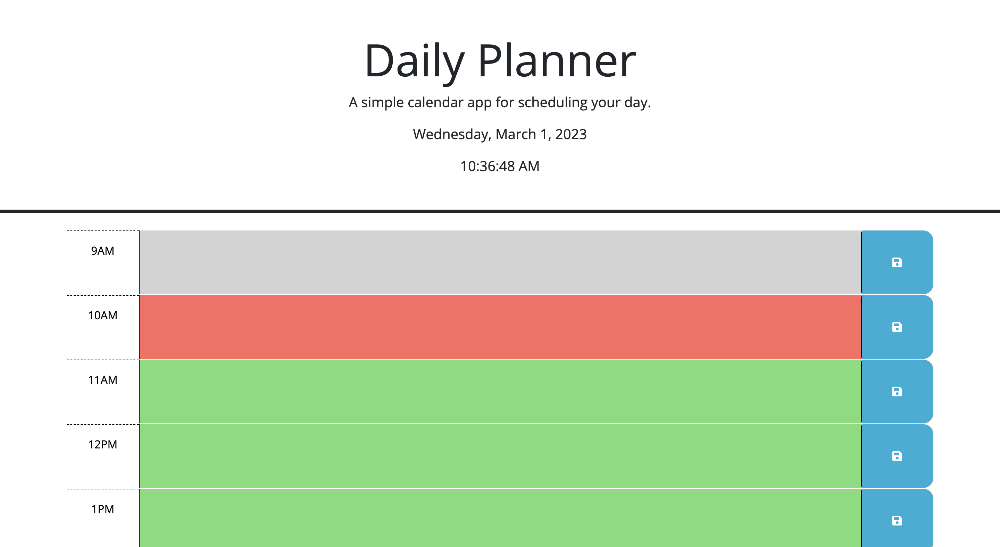

# Daily-Planner

## Description

Are you having trouble managing your time? 
Use this simple "Daily Planner" web application to plan-out your work days ahead of time.

## Tool URL

https://omar4589.github.io/Daily-Planner/

## Instructions

_Each time-block (9AM,10Am,11AM, etc.) has a text box next to it._

- Write the activity you want to focus on inside the corresponding time-block text box.

- Click the save button next to the text box to save your input. (Input saved to local storage)
  - If you'd like to edit your input:
    - Click inside the text box
    - Edit the text
    - Press the save button again to save the new input

_Each time-block is color coded based on the current hour of the day._ 

- _Grey background is used for time-blocks past the current hour_ 
- _Red background is used for the time-block matching the current hour_ 
- _Green background is used for time-blocks within a future hour_ 

_In example, if it is currently 10am, the 9am time-block will have a grey background._ 
_The 10am time-block will be red, indicating it is currently 10am & you should work on the planned activities for that time-block._ 
_Time-blocks after 10am will appear green to indicate the planned activities are to be worked on in the future._ 
 

## Screenshot

  
    
## License
   
MIT License

Copyright (c) 2022 Omar4589

Permission is hereby granted, free of charge, to any person obtaining a copy
of this software and associated documentation files (the "Software"), to deal
in the Software without restriction, including without limitation the rights
to use, copy, modify, merge, publish, distribute, sublicense, and/or sell
copies of the Software, and to permit persons to whom the Software is
furnished to do so, subject to the following conditions:

The above copyright notice and this permission notice shall be included in all
copies or substantial portions of the Software.

THE SOFTWARE IS PROVIDED "AS IS", WITHOUT WARRANTY OF ANY KIND, EXPRESS OR
IMPLIED, INCLUDING BUT NOT LIMITED TO THE WARRANTIES OF MERCHANTABILITY,
FITNESS FOR A PARTICULAR PURPOSE AND NONINFRINGEMENT. IN NO EVENT SHALL THE
AUTHORS OR COPYRIGHT HOLDERS BE LIABLE FOR ANY CLAIM, DAMAGES OR OTHER
LIABILITY, WHETHER IN AN ACTION OF CONTRACT, TORT OR OTHERWISE, ARISING FROM,
OUT OF OR IN CONNECTION WITH THE SOFTWARE OR THE USE OR OTHER DEALINGS IN THE
SOFTWARE.
